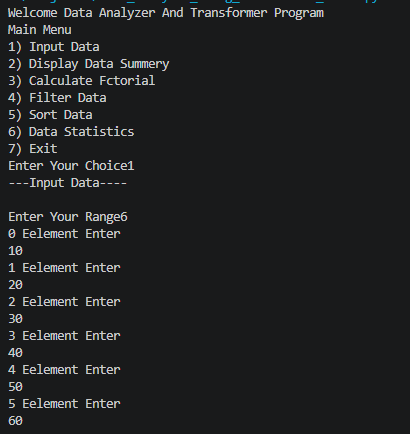
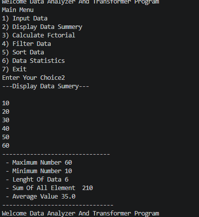
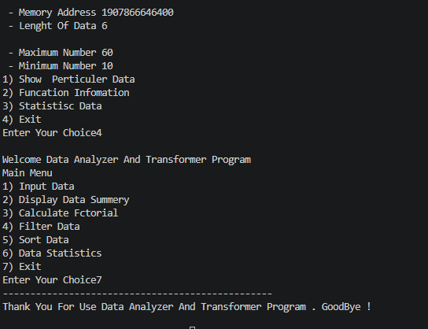

<h1>Functional Treat</h1>

<h2>Project Description</h2>

This project is an Interactive  Data Analyzer And Transformer Program . Utilizes Various Funcational 

<h2>Objectives</h2>

<ul>
<li>User Analyzer Data</li>
<li>Transformer data</li>
<li>Selecting Menu Driven Interface</li>
</ul>

<h2>Assumptions</h2>

<ul>
<li>The user will provide valid input</li>
<li>User will be entered in numeric data</li>
</ul>

<h2>Project Structure</h2>

  
project-folder Name/ 
│── Data_Analyzer_Using_Funcational_Treat.py 
│── project4_1.png 
│── project4_2.png 
│── project4_6.png 
│── project4_7.png 
│── README.md 

<h2>Output</h2>

<h2>Conclusion</h2>

This project helps in understanding basic Python concepts in a practical way and is very useful for beginners.

